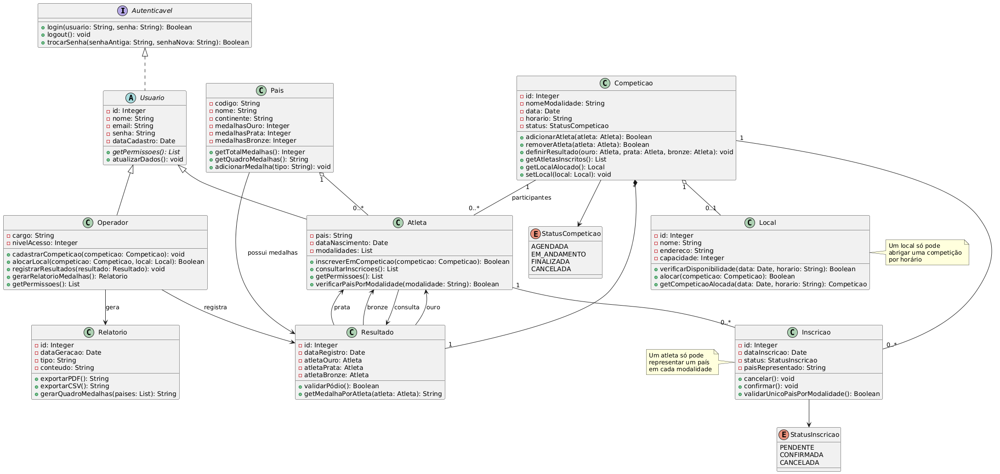
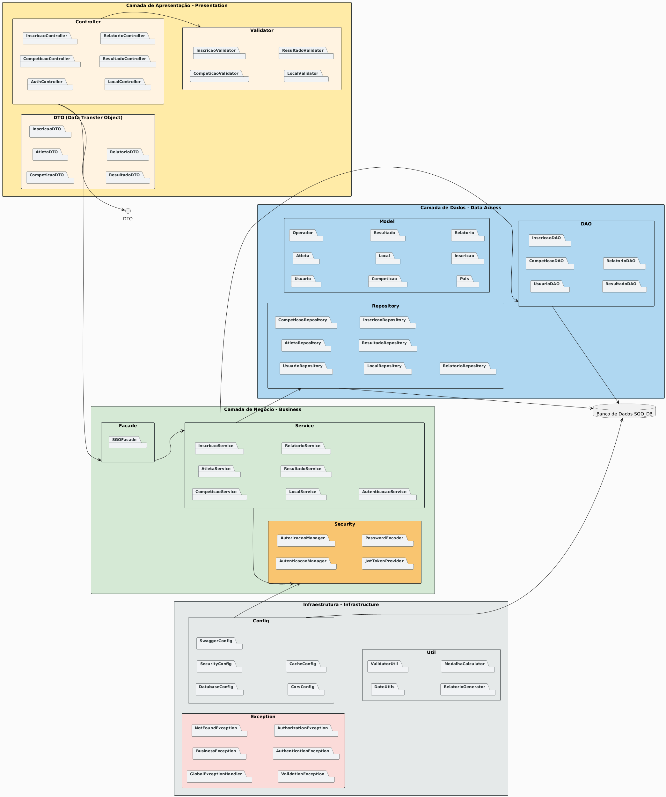
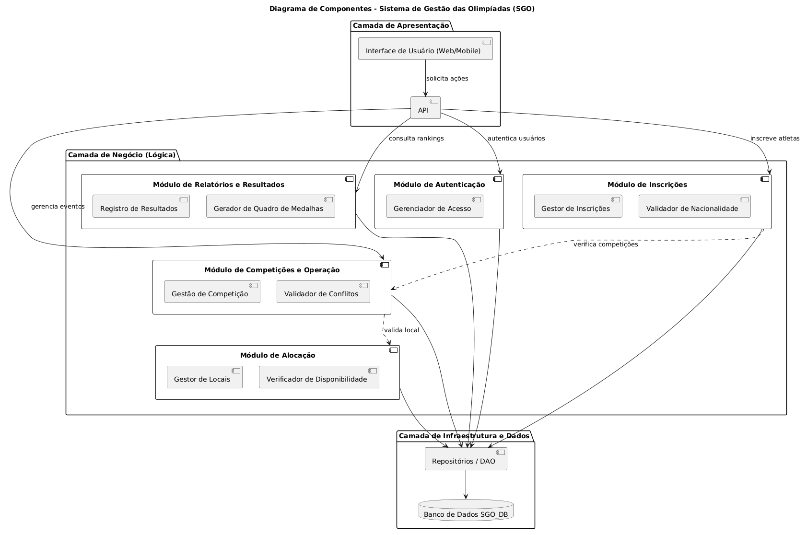
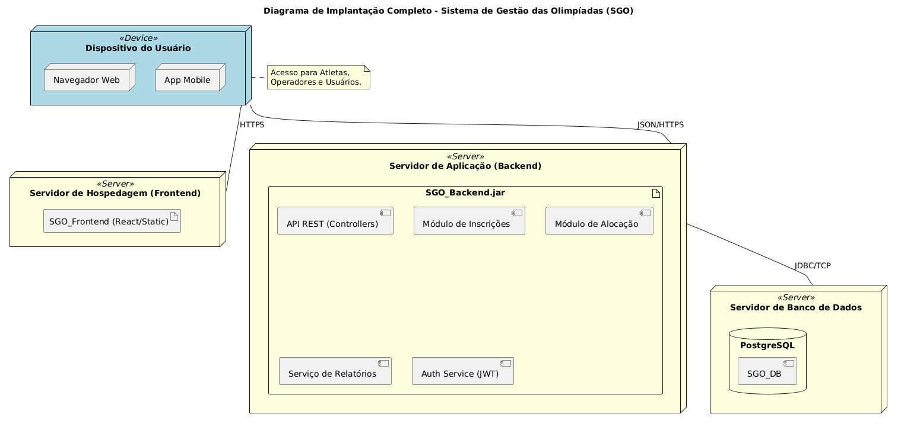

# 🏅 Sistema de Gestão das Olimpíadas (SGO)

Este projeto consiste na modelagem de um sistema para coordenar os diferentes aspectos dos Jogos Olímpicos, incluindo o gerenciamento de competições, inscrições de atletas, alocação de locais e controle de resultados.

## 🚧 Status do Projeto

[](https://github.com/joaopauloaramuni/laboratorio-de-desenvolvimento-de-software/releases) 
 
 
 
 
 
 
 
 


---

## 📚 Índice
- [Links Úteis](#-links-úteis)
- [Sobre o Projeto](#-sobre-o-projeto)
- [Histórias do Usuário](#-histórias-do-usuário)
- [Funcionalidades Principais](#-funcionalidades-principais)
- [Tecnologias Utilizadas](#-tecnologias-utilizadas)
- [Arquitetura](#-arquitetura)
  - [Diagramas](#exemplos-de-diagramas)
- [Estrutura de Pastas](#-estrutura-de-pastas)
- [Autores](#-autores)
- [Contribuição](#-contribuição)
- [Agradecimentos](#-agradecimentos)
  
---

## 🔗 Links Úteis
* 🌐 **Construção de Diagrama:** [Acesse o PlantUML](<https://www.plantuml.com/plantuml/uml/SyfFKj2rKt3CoKnELR1Io4ZDoSa70000>)
  > 💻 **Descrição:** Link para a acessar o PlantUML e testar os diagramas.

---

## 📝 Sobre o Projeto

O Sistema de Gestão das Olimpíadas (SGO) é uma plataforma integrada desenvolvida para coordenar a logística, as inscrições e os resultados do maior evento esportivo do mundo. O sistema atua como o núcleo operacional das Olimpíadas, garantindo que o cronograma de provas ocorra sem conflitos e que o quadro de medalhas seja atualizado com precisão.

* 🎯 **Propósito:**
  - Por que existe: Para centralizar o gerenciamento de múltiplos eventos esportivos simultâneos, eliminando falhas de coordenação logística e de comunicação entre delegações e organizadores.
  - Problema que resolve: A complexidade de alocar locais de prova sem sobreposição de horários e a necessidade de validar regras rígidas de representação nacional dos atletas.
  - Contexto: Projeto desenvolvido no ambiente acadêmico para simular um ecossistema real de fidelização educacional.
  - Onde utilizar: Comitês organizadores de eventos poliesportivos e federações que necessitam de um controle rigoroso sobre competições e atletas.

* ✨ **Entrega de Valor:**
  - O projeto transforma a gestão esportiva em um processo automatizado e seguro: os organizadores garantem o uso eficiente da infraestrutura disponível, os atletas asseguram sua participação conforme as regras internacionais e o público ganha transparência total no acesso aos resultados oficiais.

---

## Histórias do Usuário

*   **HS01 - Cadastrar Competição**: Como Operador, desejo cadastrar novas competições (modalidade, data, hora e local) para estabelecer o calendário olímpico.
*   **HS04 - Alocar Local de Prova**: Como Operador, desejo alocar locais específicos para evitar conflitos de horário.
*   **HS07 - Realizar Inscrição**: Como Atleta, desejo me inscrever em uma competição representando apenas um país por modalidade.
*   **HS05 - Registrar Resultados**: Como Operador, desejo registrar os vencedores para alimentar o quadro de medalhas.
*   **HS06 - Gerar Relatório de Medalhas**: Como Operador, desejo visualizar o ranking oficial por país.

---

## ✨ Funcionalidades Principais
As funcionalidades do SGO foram projetadas para atender às necessidades de Operadores e Atletas durante o evento olímpico.

- 🔐 **Autenticação Segura:** Login, Cadastro e Recuperação de Senha.
- ⚙️ **Gerenciamento de CRUD Competições:** Cadastro, alteração e cancelamento de competições, incluindo definição de modalidade, data, hora e local.
- ⚙️ **Gerenciamento de CRUD Locais:** Criação, Leitura, Atualização e Deleção de Locais.
- 📍 **Alocação Inteligente de Locais:** Conexão com serviços de terceiros (pagamentos, mapas, autenticação, etc.).
- ⚙️ **Gerenciamento de CRUD Empresas:** Criação, Leitura, Atualização e Deleção de Empresas.
- 📝 **Gerenciamento de CRUD Atletas:** Criação, Leitura, Atualização e Deleção de Atletas.
- 🥇 **Registro de Resultados e Medalhas:** Lançamento dos vencedores (1º, 2º e 3º lugares) após o encerramento das competições para oficialização no sistema.
- 📊 **Relatórios de Desempenho dos países :** Geração de quadros de medalhas e rankings oficiais por país para visualização do desempenho geral das delegações.
- 📨 **Sistema de Notificações:** Envio de alertas por e-mail, push ou notificações internas.
- 🌐 **Consulta Pública de Resultados:** Visualização dos resultados das competições encerradas para usuários não autenticados, facilitando o acompanhamento público do evento.
- 🌐 **Internacionalização (i18n):** Suporte a múltiplos idiomas.

---

## 🛠 Tecnologias Utilizadas

*   **Linguagem de Modelagem**: UML 2.0
*   **Ferramenta de Diagramação**: [PlantUML](https://plantuml.com/)
*   **Versionamento**: Git e GitHub

---

## 🏗 Arquitetura

### 1. Diagrama de Caso de Uso
Modela as interações entre os atores (Operador, Atleta e Usuário) e as funcionalidades principais.


### 2. Diagrama de Classes
Reflete a estrutura estática do sistema, organizando as classes em pacotes de responsabilidade.


### 3. Diagrama de Pacotes
Reflete a estrutura estática do sistema, organizando as classes em pacotes de responsabilidade.


### 4. Diagrama de Componentes
Ilustra a organização modular do software (Módulo de Inscrições, Alocação, Relatórios, etc.).


### 5. Diagrama de Implantação
Representa a infraestrutura física, incluindo servidores de aplicação, banco de dados e dispositivos.


---

## 📂 Estrutura de Pastas

Descreva o propósito das pastas principais.

```
.
├── README.md                            # 📘 Documentação principal do projeto.
│
├── / Codigo                             # 📁 Códigos pulm
│   ├── diagrama-de-caso-de-uso.puml     # 📜 Código para o digrama.
│   ├── diagrama-de-classes.puml         # 📜 Código para o digrama.
│   ├── diagrama-de-componentes.puml     # 📜 Código para o digrama.
│   ├── diagrama-de-implantacao.puml     # 📜 Código para o digrama.
│   └── diagrama-de-pacotes.puml         # 📜 Código para o digrama.
│
├── / Modelagem                          # 📁 Imagens dos diagramas
│   ├── /Caso de Uso                     # 📁 Imagem do diagram de Casdo de Uso
│   │   └── diagrama-de-caso-de-uso.png  # 🖼️ Diagrama.
│   ├── /Classe                          # 📁 Imagem do diagram de Classe
│   │   └── diagrama-de-classes.png      # 🖼️ Diagrama.
│   ├── /Componentes                     # 📁 Imagem do diagram de Casdo de Uso
│   │   └── Diagrama-de-componentes.png  # 🖼️ Diagrama.
│   ├── /Implantacao                     # 📁 Imagem do diagram de Casdo de Uso
│   │   └── Diagrama-de-Implantacao.png  # 🖼️ Diagrama.
│   ├── /Pacote                          # 📁 Imagem do diagram de Casdo de Uso
│   │   └── diagrama-de-pacotes.png      # 🖼️ Diagrama.
└── 
```

---

## 👥 Autores
Liste os principais contribuidores. Você pode usar links para seus perfis.

| 👤 Nome | 🖼️ Foto | :octocat: GitHub | 💼 LinkedIn | 📤 Gmail |
|---------|----------|-----------------|-------------|-----------|
| Vinícius Simões  | <div align="center"></div> | <div align="center"><a href="https://github.com/ViniSimoesV"></a></div> | <div align="center"><a href="https://www.linkedin.com/in/user1"></a></div> | <div align="center"><a href="mailto:user1@gmail.com"></a></div> |
| Karen Joilly | <div align="center"></div> | <div align="center"><a href="https://github.com/karenjoilly11"></a></div> | <div align="center"><a href="https://www.linkedin.com/in/user2"></a></div> | <div align="center"><a href="mailto:user2@gmail.com"></a></div> |

---

## 🙏 Agradecimentos
Em ambiente acadêmico, citar fontes e inspirações é crucial (integridade acadêmica). Em ambiente profissional, mostra humildade e conexão com a comunidade.

Gostaria de agradecer aos seguintes canais e pessoas que foram fundamentais para o desenvolvimento deste projeto:

* [**Engenharia de Software PUC Minas**](https://www.instagram.com/engsoftwarepucminas/) - Pelo apoio institucional, estrutura acadêmica e fomento à inovação e boas práticas de engenharia.
* [**Prof. Dr. João Paulo Aramuni**](https://github.com/joaopauloaramuni) - Pelos valiosos ensinamentos sobre **Arquitetura de Software** e **Padrões de Projeto**.
* [**Fernanda Kipper**](https://www.instagram.com/kipper.dev/) - Pelos valiosos ensinamentos em **Desenvolvimento Web**, **DevOps** e melhores práticas em **Front-end**.
* [**Rodrigo Branas**](https://branas.io/) - Pela didática excepcional em **Clean Architecture** e **Clean Code**.
* [**Código Fonte TV**](https://codigofonte.tv/) - Pelo vasto conteúdo e cobertura de notícias, tutoriais e apoio à comunidade de **Desenvolvimento Web**.

---
